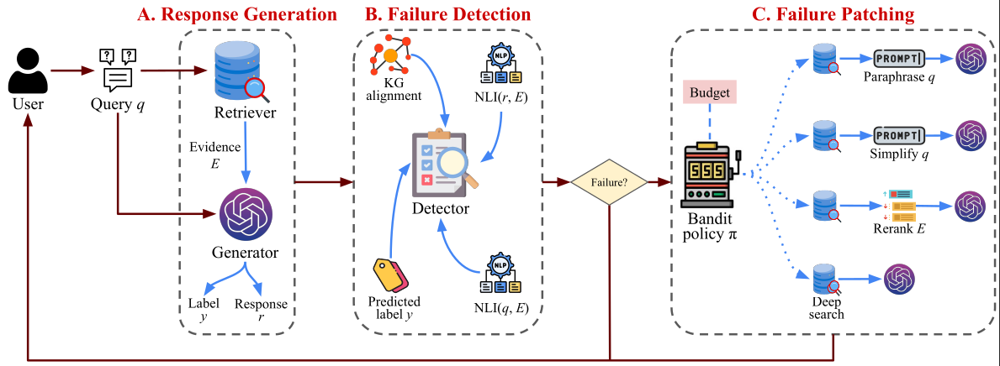

# Diagnosing and Repairing Factual Errors in RAG under Budget Constraints



Retrieval-Augmented Generation (RAG) improves the factuality of large language models by grounding responses in external evidence, yet practical deployments remain brittle: failures arise from missing evidence, noisy retrieval, and generation that is unfaithful to the retrieved context. We propose **D2R-RAG** (Diagnose-to-Repair RAG), a model-agnostic, resource-aware framework that couples lightweight failure diagnosis with adaptive repair. **D2R-RAG** produces interpretable failure signatures from observable signals in the query, retrieved evidence, and generated response, and uses these signals to adaptively select among a small set of corrective actions under explicit latency and VRAM budgets.

---

## 🚀 Getting Started

### Prerequisites

* Python 3.x
* PyTorch, Transformers, FAISS, NetworkX, LlamaIndex, RAGAS

### Installation

```bash
git clone https://github.com/[your-username]/D2RRAG.git
cd D2RRAG
bash run.sh

```

---

## 🧪 Running Experiments

### 1. FEVER Dataset

To run the full suite of experiments for the FEVER dataset, follow these stages:

**Knowledge Base Initialization**

```bash
python src/create_knowledge_base.py fever

```

**Main Bandit Policies (LinUCB & Thompson Sampling)**

```bash
# LinUCB
python experiments/analysis.py fever
python src/train.py fever
python experiments/analysis_patched.py fever
python src/report_metrics.py fever
python src/report_metrics_patched.py fever

# Thompson Sampling
python experiments/analysis.py fever_ts
python src/train.py fever_ts
python experiments/analysis_patched.py fever_ts
python src/report_metrics.py fever_ts
python src/report_metrics_patched.py fever_ts

```

**Baselines & Ablations**

```bash
# Baseline Evaluations
python src/report_metrics_patched.py fever_paraph
python src/report_metrics_patched.py fever_top20
python src/report_metrics_patched.py fever_bestarm

# Reward Integrity (No Gate vs. No Cost)
python src/train.py fever_nogate
python experiments/analysis_patched.py fever_nogate
python src/report_metrics_patched.py fever_nogate

python src/train.py fever_nocost
python experiments/analysis_patched.py fever_nocost
python src/report_metrics_patched.py fever_nocost

```

**Advanced Analysis (Oracle & Budget Sensitivity)**

```bash
# Post-hoc Oracle
python experiments/analysis_posthoc.py fever
python src/report_metrics_patched.py fever_posthoc

# Budget Sensitivity (Tight vs. Loose Budgets)
python src/train.py fever_tb
python experiments/analysis_patched.py fever_tb
python src/report_metrics_patched.py fever_tb

python src/train.py fever_lb
python experiments/analysis_patched.py fever_lb
python src/report_metrics_patched.py fever_lb

```

---

### 2. HotpotQA Dataset

For HotpotQA, specific scripts handle short-answer verification:

**Main Bandit Policies**

```bash
# LinUCB
python experiments/analysis_shortanswer.py hotpotqa
python src/train_shortanswer.py hotpotqa
python experiments/analysis_shortanswer_patched.py hotpotqa
python src/report_metrics.py hotpotqa
python src/report_metrics_patched.py hotpotqa

# Thompson Sampling
python experiments/analysis_shortanswer.py hotpotqa_ts
python src/train_shortanswer.py hotpotqa_ts
python experiments/analysis_shortanswer_patched.py hotpotqa_ts
python src/report_metrics.py hotpotqa_ts
python src/report_metrics_patched.py hotpotqa_ts

```

**Baselines & Ablations**

```bash
# Baseline Evaluations
python src/report_metrics_patched.py hotpotqa_paraph
python src/report_metrics_patched.py hotpotqa_top20
python src/report_metrics_patched.py hotpotqa_bestarm

# Reward Integrity
python src/train_shortanswer.py hotpotqa_nogate
python experiments/analysis_shortanswer_patched.py hotpotqa_nogate
python src/report_metrics_patched.py hotpotqa_nogate

python src/train_shortanswer.py hotpotqa_nocost
python experiments/analysis_shortanswer_patched.py hotpotqa_nocost
python src/report_metrics_patched.py hotpotqa_nocost

```

**Advanced Analysis**

```bash
# Post-hoc Oracle
python experiments/analysis_shortanswer_posthoc.py hotpotqa
python src/report_metrics_patched.py hotpotqa_posthoc

# Budget Sensitivity
python src/train_shortanswer.py hotpotqa_tb
python experiments/analysis_shortanswer_patched.py hotpotqa_tb
python src/report_metrics_patched.py hotpotqa_tb

python src/train_shortanswer.py hotpotqa_lb
python experiments/analysis_shortanswer_patched.py hotpotqa_lb
python src/report_metrics_patched.py hotpotqa_lb

```

---


## 📝 Citation

If you use this work in your research, please cite:

```bibtex
@inproceedings{
hashemifar2026diag,
title={Diagnosing and Repairing Factual Errors in RAG under Budget Constraints},
author={Soroush Hashemifar, Havva Alizadeh Noughabi, Fattane Zarrinkalam, Ali Dehghantanha},
booktitle={The 39th Canadian Conference on Artificial Intelligence},
year={2026},
}
```
